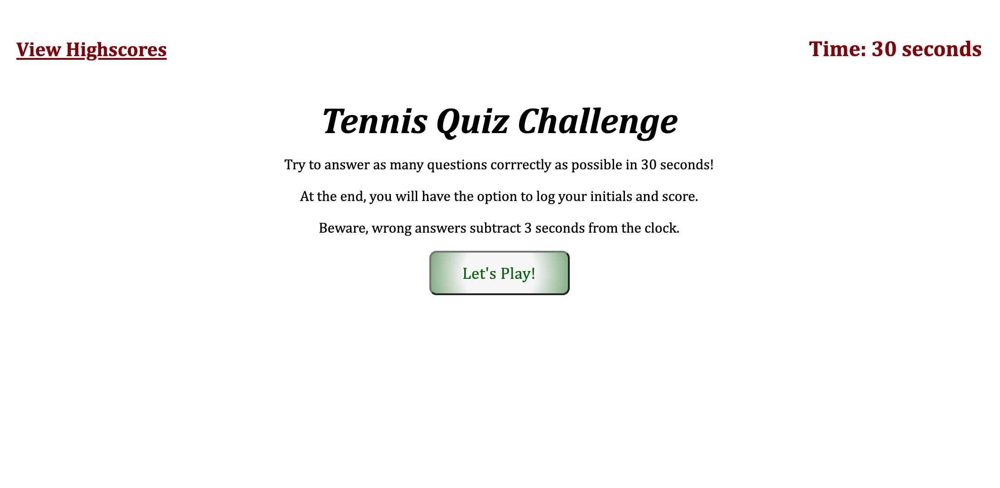

# coding-quiz
* As a developer, I created a tennis-themed quiz game. Given a 30 second timer, the user will answer a series of questions. Each correct question adds one point to the user's score. At the end of the game, the user's final score and initials will be recorded in the "high scores" section.

## About the Project
This project utilizes Javascript functionality to make the web application interactive.

## Screenshot
Here is a sample image of how the coding quiz appears in your browser:

## Getting Started

Enter the following link to access the quiz:

https://vbmisra.github.io/tennis-quiz/

Enter the following link to access the repository:

https://github.com/vbmisra/tennis-quiz/settings/pages
